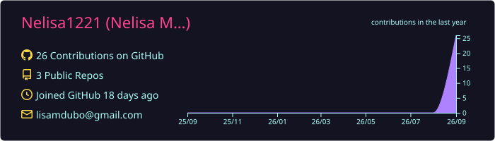
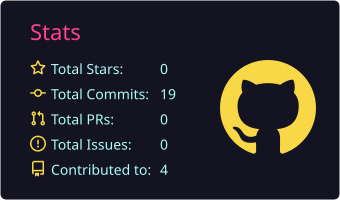
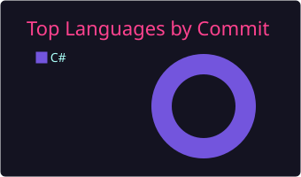
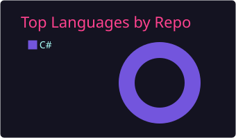

<h1 align="center">Nelisa</h1>

  <b>Information Technology Student</b> · Aspiring Software Developer

  

## who am i

I'm **Nelisa**, an Information Technology student passionate about software development, databases, and data analysis. I build Windows Forms applications in C# and .NET, design and query databases, and explore machine learning and forecasting with Python. Currently focused on building practical, user-friendly applications and growing my portfolio.

---

## stack

  
  
  
  
  
  
  
  
  
  

  
  
  
  
  

  data cleaning · forecasting · machine learning · database design

---

## projects

| | Project | What it does | Tech |
|---|---|---|---|
| 🍕 | **Pizza Ordering Application** | Create pizza orders, pick sizes, crusts and toppings, and calculate the total cost. | C#, .NET, Windows Forms |
| 🗄️ | **Student Database System** | Student information, SQL queries, database design, and C# database connectivity. | C#, SQL, MySQL / SQL Server |
| 📊 | **Data Analysis & Forecasting** | Dataset cleaning, exploration, visualization, and forecasting to identify patterns and trends. | Python, Pandas, NumPy, Matplotlib |
| 💧 | **Water Quality Analysis** | Analysing water-quality data and experimenting with classification models. | Python, Pandas, Scikit-learn, XGBoost |

---

## stats

  
  

  
  

  

---

## currently learning

  
  
  
  
  
  

## goals

- Build more real-world software applications
- Improve my C# and .NET skills and get confident with database development
- Develop stronger Python and data-analysis skills, and learn more about machine learning
- Contribute to open-source projects
- Build a strong software development portfolio

---

<h3 align="center">let's build something.</h3>

  always open to learning, collaborating, and connecting with other developers and students

  
  

  thanks for visiting my profile 🚀

